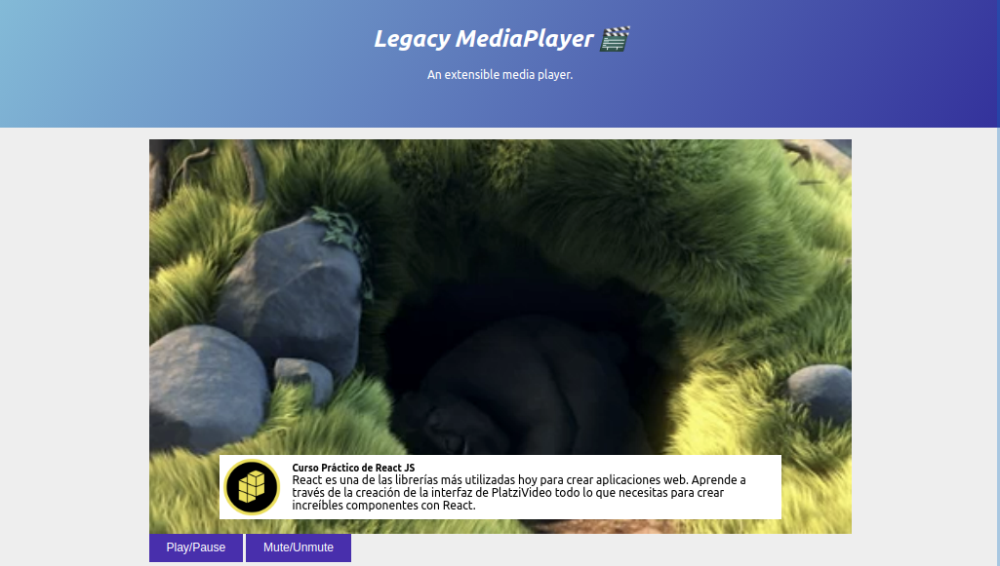

# PL-JS01-Legacy-MediaPlayer 🎬

Video playback platform. Legacy Media Player offers a collection of plugins that extend the functionality of the video player.

<p align=center></p>

***

# ▶️ Legacy MediaPlayer | Plugins

<p align="left">
  

  

  
</p>

## Description

<p align=justify>
  This <b>MediaPlayer</b> is a project developed at the platzi javascript school, in the professional javascript course. It consists of a series of plugins that extend the functionalities of the browser's web player.
</p>

<p>The main plugins offered by the player are:</p>
<ul>
  <li>⏯ Play and pause button.</li>
  <li>🔇 Mute and unmute button.</li>
  <li>⏬ Player pause when moving down to comment section.</li>
  <li>📂 Player pause when switching tabs or minimizing site.</li>
  <li>🆕 Present timed ads.</li>
  <li>🌐 The site works offline!</li>
</ul>

*** 

<p align="justify">
  
</p>

***

## Prerequisites 📋

_To run this program you must have the following dependencies installed_

* NPM
* live-server
* parcel-blunder
* typescript

## Deployment 📤

```PowerShell
# Dev mode
> npm install
> npm fund
> npm start
```

## Built With

For the development of this project we use the following technologies

<table style="border:1px solid black;margin-left:auto;margin-right:auto;">
  <tr>
    <td>
      <p align=center></p>
    </td>
    <td>
      <p align=center></p>
    </td>
    <td>
      <p align=center></p>
    </td>
    <td>
      <p align=center></p>
    </td>
  </tr>
  
  <tr>
    <td>
      <p align=center><a href="https://www.angular.io"><b>NPM</b></a>
        </br>Package Manager</p>
    </td>
    <td>
      <p align=center><a href="https://dotnet.microsoft.com/apps/aspnet"><b>HTML5</b></a>
</br>Web Interface</p>
    </td>
    <td>
      <p align=center>
        <a href="https://developer.android.com/studio"><b>CSS</b></a>
</br>To make it look cool</p>
    </td>
    <td>
      <p align=center> <a href="https://www.microsoft.com/es-es/sql-server/sql-server-downloads"><b>Typescript</b></a>
        </br>The core of everything</p>
    </td>
  </tr>
</table>

## Docs 📖

You can find the <b>notes and the slides</b> of the course in our [documentation section](https://github.com/estalvgs1999/PLJS01-Legacy-MediaPlayer/doc)

## Authors

I have developed this project on my way to becoming an Angular professional.
* **Esteban Alvarado** - *Software Developer* - [@estalvgs1999](https://github.com/estalvgs1999)

The thanks for this project go to [platzi](https://platzi.com/clases/javascript-profesional/)!

## License 📄

This project is licensed under the GNU License - see the [LICENSE.md](https://github.com/PLJS01-Legacy-MediaPlayer/LICENSE) file for details

***
<p align="center">

</p>